### Edycja analityczna Humdrum

# Instrukcja pracy w projekcie

Ta instrukcja prowadzi krok po kroku przez cały proces pracy w projekcie.
Nie jest wymagana wcześniejsza znajomość GitHuba ani programowania.

## 1️⃣ Wymagania wstępne (jednorazowo)
1. Konto GitHub

Upewnij się, że masz konto na https://github.com

Zostaniesz dodany(a) do projektu przez kierownika projektu — **zaakceptuj zaproszenie**, które przyjdzie e-mailem lub w GitHubie.

2. Instalacja VS Code

Wejdź na: https://code.visualstudio.com

Pobierz wersję dla swojego systemu (Windows / macOS / Linux)

Zainstaluj program (standardowe ustawienia, „Dalej, dalej”)

3. Połączenie VS Code z GitHubem (jednorazowo)

Otwórz **VS Code**

Kliknij ikonę **Source Control** (rozgałęzienie po lewej stronie) 

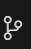

Kliknij **Clone Repository** i wybierz **Clone from GitHub**

Zostaniesz poproszony(a) o zalogowanie do GitHuba w przeglądarce — zaloguj się i zatwierdź.

Wpisz adres tego projektu:
https://github.com/annamatuszewska/edycja-humdrum.git

Wybierz folder na swoim komputerze, gdzie projekt ma się zapisać (**uwaga!** lepiej nie zapisywać na pulpicie, aby uniknąć przypadkowego usunięcia)

Po chwili projekt otworzy się w VS Code.

---
## 2️⃣ Zasada organizacyjna projektu (bardzo ważne)

Pracujesz i zapisujesz ostateczne wersje plików lokalnie zawsze w tym samym wybranym folderze.

Pracujesz **zawsze na osobnym branchu** - patrz p. 3️⃣

Jeden branch = **jedna partia (50 plików)**

Po przesłaniu Pull Request **nie zmieniasz już tego brancha**

---
## 3️⃣ Rozpoczęcie pracy nad nową partią
### Krok 1 – utworzenie nowego brancha

Branch tworzysz zawsze przed rozpoczęciem nowej partii.
W VS Code znajdź "Create branch":

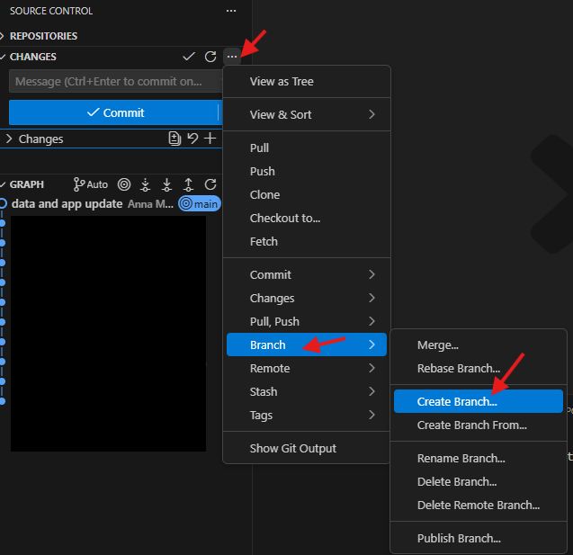

Schemat nazwy brancha:
imię-nazwaksiazki-nrplikustart-nrplikukoniec

Przykład:
anna-dwok02-0001-0050

Kliknij na **Publish branch** (nie trzeba wpisywać wiadomości)

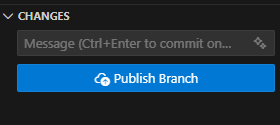

Branch został zarejstrowany w repozytorium oraz od tego momentu wszystkie zmiany zapisują się lokalnie na tym branchu.

Jeśli chcesz mieć pewność, że pracujesz na właściwym branchu spójrz do okienka **Graph**

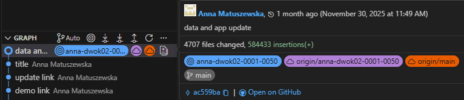

Koncentryczne okręgi oznaczają lokalny branch a chmurka oznacza, że branch zarajestrowano też w repozytorium.

### Krok 2 - praca z plikami

**Edytuj tylko pliki ze swojej partii**

Pliki:

poprawiane: w folderze humdrum/...

nowe teksty: w folderze tekst/...

Nie zmieniaj innych folderów ani plików. 
Nie trzeba przenosić plików ani folderów, zmieniać nazw itp., ponieważ historia zmian na Twoim branchu zapisuje się oddzielnie od plików źródłowych (main).

Pliki zapisuj normalnie (Ctrl+S / Cmd+S).

### Krok 3 - zakończenie pracy nad partią (commit)

- po zakończeniu edycji wszystkich 50 plików w sekcji Source Control sprawdź, czy w okienku **CHANGES** znajdują się prawidłowe pliki

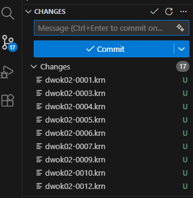

- wpisz wiadomość w okienku Message nad przyciskiem **Commit** w formie:

"Nazwaksiazki pliki nrplikustart–nrplikukoniec"

Przykład:
"DWOK02 pliki 001–050"

Wciśnij **Commit** a następnie **Sync Changes** (nie trzeba wpisywać wiadomości)

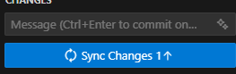

### Krok 4 - Przesłanie pracy do sprawdzenia (Pull Request)

- Sprawdź [w repozytorium github projektu](https://github.com/annamatuszewska/edycja-humdrum) czy pojawiły się Twoje zmiany.

Automatycznie powinna się pojawić taka wiadomość:

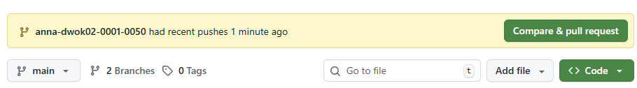

– kliknij na **Compare & pull request**

Jeśli nie jest dostępne przejdź do zakładki **Pull request** -> **New pull request**

Upewnij się, że:

base: main  <- compare: Twój branch

W opisie wpisz krótko:

jaka książka

zakres plików (np. 001–050)

Kliknij Create Pull Request

Na tym etapie Twoja praca jest gotowa.

### Krok 5 - Rozpoczęcie kolejnej partii

Dla kolejnej partii przed stworzeniem nowego brancha należy przejść na main:

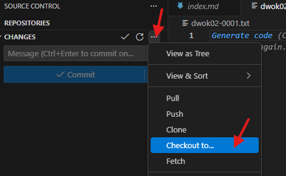

Wybierz main lokalny 
**!uwaga!** nie wybieraj main z "remote branches"

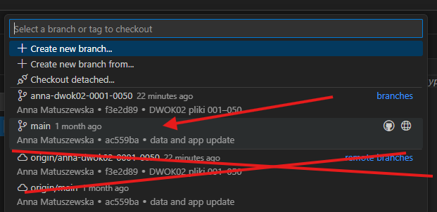

Następnie powtórz działania od **Kroku 1** zakładając nowy branch - pamiętaj o odpowiedniej nazwie.

### Krok 6 - Po akceptacji Pull Request

Po zaakceptowaniu i połączeniu (merge) przez kierownika projektu:

Krok 1 – odświeżenie informacji o repo używając polecenia fetch:

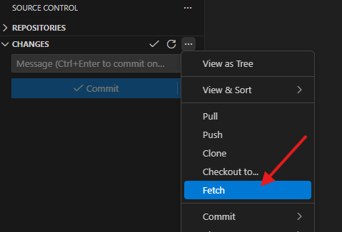

Krok 2 – usunięcie lokalnego brancha (branch w repozytorium będzie już usunięty)

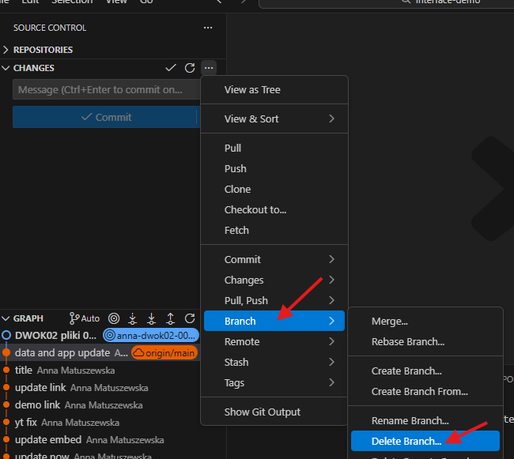

To porządkuje lokalną listę branchy. 

Nie usuwaj lokalnego brancha dopóki pull request nie został zaakceptowany. Po prostu przejdź do main i stwórz nowy branch. Do poprzednich branchy można wrócić jeśli zajdzie taka potrzeba.

---
## 4️⃣ Kiedy używać git pull?

Git pull powoduje pobranie aktualnego stanu projektu i nadpisanie stanu lokalnych plików.

**!używaj git pull tylko, gdy jesteś na branchu main!** (Check out to... -> main)

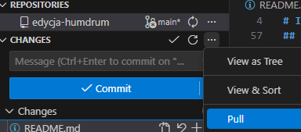

Jak i kiedy najbezpieczniej użwać:

- Zawsze przed rozpoczęciem nowej partii, tj. po wysłaniu pull request dla ostatniej partii i przejściu na branch main

- Gdy kierownik projektu poinformuje, że jest to konieczne

- Nie używaj git pull w trakcie pracy nad jedną partią.

---
## 5️⃣ Najważniejsze zasady (podsumowanie)

✔️ jedna partia = jeden branch

✔️ po wysłaniu Pull Request przechodzisz do kolejnej partii

✔️ nie zmieniasz plików poza swoim zakresem

✔️ zawsze zaczynasz nowy branch z main